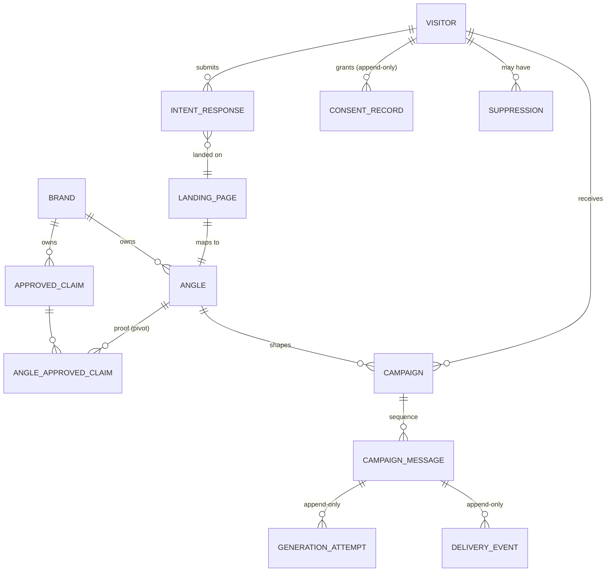

# Architecture — Intent-Led Campaign System

> Status: **Finalised** — this document is the T-01 deliverable ("define the campaign
> contract and safety policy"). It is the binding contract that T-02 (domain schema) and
> T-09 (generation + validation) implement against, and that T-11 (audit dashboard) must
> be able to reconstruct. No provisional sections remain.

---

## 1. Overview

The system proves one loop end to end at small scale:

```
visitor lands on an angle-specific page
  → tells us who they are and what they want
  → system generates and sends a campaign written for that specific person
```

The loop in full:

```
Landing page (static, angle-bound)
  → capture quiz (intent + demographics + explicit consent)
  → campaign generation (LLM prose + deterministic facts/blocks)
  → policy validation (deterministic code)
  → queued delivery (consent + suppression re-checked at send time)
  → audit trail (every decision persisted, append-only)
```

### Non-goals

- **No page builder.** Landing pages are hand-written and static; nothing composes pages
  from angle or brand records at runtime.
- **No runtime angle matching.** The angle is fixed by the landing page, never decided by
  quiz answers.
- **No free-form claims.** The model never invents facts; it only references approved
  claim records owned by the brand.
- **No SMS provider integration** (bonus B-01 persists SMS, does not deliver it).

---

## 2. Design principles

1. **Personalisation is the assignment; trust is deterministic.** The LLM is a prose
   draftsman, not an oracle.
2. **Constraints are enforced by code, never merely suggested to the model.**
3. **The model writes only personalisation/transition prose and selects approved claim
   IDs.** Everything else — facts, offer, compliance language, sign-off, sequence shape —
   is composed deterministically.
4. **The angle is chosen by the landing page, not by quiz answers.** The quiz captures
   intent _within_ an angle.
5. **Demographics shape presentation, never clinical claims.** Age and sex select a
   computed "presentation profile"; they cannot reach the model as a basis for clinical
   inference.
6. **All audit records are append-only and immutable.** A review can reconstruct the full
   chain at any time.
7. **The visitor arrives with latent intent, not a made-up mind.** The campaign converts a
   concern or job-to-be-done into a confident next step by resolving the objection — never
   by manufacturing urgency.

---

## 3. Domain model & ownership boundaries

> Defined here on paper; T-02 creates the migrations, models, factories, and relationships.

### Entities

| Entity                             | Owned by                  | Purpose                                                                                              |
| ---------------------------------- | ------------------------- | ---------------------------------------------------------------------------------------------------- |
| `Brand`                            | —                         | Root. Visual identity, voice, reading level, sign-off, required/banned phrases, compliance language. |
| `ApprovedClaim`                    | Brand                     | Structured, approved fact/mechanism/credential. Only source of claims in emails.                     |
| `Angle`                            | Brand                     | Strategic anchor: 11 PRD fields. Not a headline, not a matcher.                                      |
| `LandingPage` (landing identifier) | Angle                     | Stable identifier mapping a static page to a seeded angle.                                           |
| `Visitor`                          | —                         | Demographics + email; the person being messaged.                                                     |
| `IntentResponse`                   | Visitor                   | One per capture: sub-interest, trigger, concern, page/angle context, timestamp. Immutable.           |
| `ConsentRecord`                    | Visitor                   | Affirmative consent per channel, with source, timestamp, policy/version, exact address. Append-only. |
| `Suppression`                      | Visitor                   | Durable opt-out/conversion state. Cannot be bypassed by a queued send.                               |
| `Campaign`                         | Visitor + Angle (+ Brand) | One per capture; the generated 3-message sequence.                                                   |
| `CampaignMessage`                  | Campaign                  | One row per sequence position **and** channel.                                                       |
| `GenerationAttempt`                | CampaignMessage           | Append-only: prompt version, provider/model, raw response, policy result, composed output.           |
| `DeliveryEvent`                    | CampaignMessage           | Append-only: attempted / sent / skipped / failed with actionable error.                              |

### Ownership rules

- A `Brand` owns `ApprovedClaim`, `Angle`, and (transitively) `Campaign`.
- An `Angle` selects its `proof` from the owning brand's `ApprovedClaim` records via a
  many-to-many pivot (`angle_approved_claim`).
- A `LandingPage` maps to exactly one `Angle` by a stable identifier.
- A `Visitor` owns `IntentResponse`, `ConsentRecord`, and `Suppression`; these are never
  mutated after creation (consent and suppression are appended, not edited).
- A `CampaignMessage` is keyed by `(campaign_id, sequence_position, channel)` so email
  audit data is queryable without parsing blobs.



---

## 4. Landing page → angle → brand

A static landing page inherits its brand through the chain `page → angle → brand`.

### Binding: authored, not composed

- The page **copy is authored with a specific angle in mind** (it must message-match the
  angle) and is **hand-written in the owning brand's visual identity and voice**.
- The page does **not** read angle or brand records at runtime, and does **not** embed the
  angle's data. It carries only a **stable landing identifier** (slug).
- At capture, the identifier resolves to the **current** angle record, which is the
  authoritative generation input.

```
Landing page (static, hand-written copy)
   └── landing_identifier: "fatigue-low-energy"    ← fixed, seeded

Angle record (dynamic, admin-managed)
   └── slug: "fatigue-low-energy"                   ← resolved at capture
```

### Consequences

- **Admin edits to an angle** change future campaign generation, not the page copy.
  (Possible drift between page copy and angle record is accepted in this demo.)
- **Admin edits to a brand** change live email generation and the admin UI, but do **not**
  re-skin static pages.
- **Brand tokens live in two places**: the brand record (authoritative for the email
  pipeline) and the page's CSS/copy snapshot.
- **Brand constraints are machine-enforced only on generated copy**, not on hand-written
  pages (which are human-authored and comply manually).

### Edge cases

- **Archived angle** → the page's identifier stops resolving → capture rejects with a
  clear "campaign unavailable" state; no mid-generation failure. Historical audit records
  are unaffected.
- **Angle without a page** → an admin-created angle has no entry point until a developer
  hand-writes a page for it. This is the deliberate cut, not a gap.
- **Eligibility rule** → an angle may generate campaigns only if a landing identifier maps
  to it.

---

## 5. Angle-field routing

The 11 PRD fields split into four buckets by _who writes them_ and _how freely_. The
guiding principle: **fact-backed fields are hard rules; expressive fields are model prose
under a hard constraint.** Safety comes from the deterministic validator (§8), not from
hiding fields — so all 11 fields feed generation and **none are editorial-only**.

| Bucket                                           | Fields                                                          | Model's role                                                            |
| ------------------------------------------------ | --------------------------------------------------------------- | ----------------------------------------------------------------------- |
| **Deterministic** (rendered as-is)               | Proof, Offer, Next step                                         | Never writes them; references claim IDs / transitions into them at most |
| **Hard instruction** (enum)                      | Tone                                                            | Applies it as a constraint; never changes it                            |
| **Bounded prose** (content fixed, phrasing free) | Single promise, Objection                                       | Writes the phrasing — "restate, don't expand"; "address, don't invent"  |
| **Context** (shapes emphasis & framing)          | Audience, Trigger moment, Primary job, Tension, Desired outcome | Uses them to write; never states them as fact or promise                |

Per-field detail:

| Angle field     | Bucket           | Reaches model as       | Rationale                                                  |
| --------------- | ---------------- | ---------------------- | ---------------------------------------------------------- |
| Audience        | Context          | text                   | Write for the right person                                 |
| Trigger moment  | Context          | text                   | Acknowledge the real trigger; never escalate it            |
| Primary job     | Context          | text                   | Drives _emphasis_ — the progress they're trying to make    |
| Tension         | Context          | text                   | Empathetic framing only; validator caps clinical inference |
| Desired outcome | Context          | text                   | Framing only — never promised as guaranteed                |
| Single promise  | Bounded prose    | text (restate only)    | Content authoritative; phrasing personalised               |
| Proof           | Deterministic    | claim IDs              | Facts served from `ApprovedClaim`, never improvised        |
| Objection       | Bounded prose    | text                   | Address the recorded objection; never invent one           |
| Offer           | Deterministic    | none (transition only) | Truthful terms never paraphrased                           |
| Tone            | Hard instruction | enum                   | Brand constraint, enforced                                 |
| Next step       | Deterministic    | none                   | Consistent, truthful CTA                                   |

The **Context** bucket is the one most likely to drift toward diagnosis or urgency
(`Tension`, `Desired outcome`, `Trigger moment`). The validator (§8, checks 5–7) is the
backstop that makes this safe — these fields are fed _because_ the validator catches
misuse, rather than demoting them to editorial.

---

## 6. Generation: LLM vs deterministic split

| Deterministic (code)                                              | LLM (model)                                     |
| ----------------------------------------------------------------- | ----------------------------------------------- |
| Brand constraints (voice, reading level, required/banned phrases) | Restating the promise in the visitor's language |
| Approved claims as structured records                             | Explaining the mechanism plainly                |
| Compliance blocks, offer, sign-off, unsubscribe footer            | Addressing the angle-specific objection         |
| Sequence shape (promise → mechanism → objection)                  | Selecting **which** claim IDs to reference      |
| Consent / suppression checks                                      | Subject line, headline, body paragraphs         |
| Demographic → presentation profile lookup                         | —                                               |
| Policy validator, retry, fail-closed                              | —                                               |
| Final email composition (validated prose + deterministic blocks)  | —                                               |
| Audit persistence                                                 | —                                               |

The final email is **composed** as:

```
validated model core (subject + headline + body prose, claim references resolved)
+ deterministic offer block
+ deterministic compliance language
+ deterministic sign-off
+ unsubscribe footer
```

### Presentation profile (demographics)

Age and sex map through a **fixed lookup table in code** to a presentation profile:

- vocabulary register, sentence length/pacing, how much reassurance vs brevity;
- typography: type size, visual density, imagery tone.

The profile is computed in code, passed to the model as **writing instructions**, and used
by the email renderer for typography. Because the profile — not the raw demographics — is
what reaches the model, demographics structurally cannot become clinical recommendations.

### Offer, next step & the terminal CTA

The business is DTC blood testing: the visitor lands with a concern ("always tired"), not a
purchase decision. The campaign converts that latent intent into a confident next step —
confirming they're in the right place, making the mechanism plain, and removing _this
person's_ specific objection. It reinforces and directs motivation; it never manufactures
urgency.

- **`offer`** = what makes acting now easier (a discount, a bundle) — always a truthful,
  precisely stated term, never a fake deadline or scarcity.
- **`next step`** = the CTA itself ("Order the fatigue panel"). It must be the smallest
  clear action, and framed as _getting clarity on your numbers_, never as a diagnosis
  ("find out if you have X").
- Both are **deterministic, angle-scoped blocks** composed after the objection is handled
  (email 3 or a later beat). Personalisation lives in the prose leading _up to_ the CTA,
  never inside the CTA.

---

## 7. Model response schema

The model returns valid JSON for the three beats. The **invariant**: the model writes only
the fields below and selects claim IDs; it cannot emit offer, compliance, or sign-off text.

```jsonc
{
  "messages": [
    {
      "position": 1, // 1..3, fixed
      "role": "promise", // promise | mechanism | objection
      "subject": "string", // validated for accuracy (guardrail 5)
      "headline": "string",
      "body_paragraphs": ["..."], // personalisation / transition prose
      "claim_ids": ["uuid", "..."], // ApprovedClaim UUIDs, must resolve to the brand
    },
    // position 2 = mechanism, position 3 = objection
  ],
}
```

- `claim_ids` must reference claims owned by the campaign's brand.
- The full formal schema lives in the runtime contract (`response-schema.md`); this
  document fixes only the shape and the ownership invariant.
- Each attempt records: prompt version, provider/model, raw structured response, policy
  result, and final composed output.

---

## 8. Validation, retry, and fail-closed policy

The validator is **deterministic code, not a second LLM**. This is what makes the
guardrails "enforced, not suggested".

### Validator checks

1. **Structural validity** — JSON parses; all three positions present with required fields.
2. **Claim reference validity** — every `claim_id` resolves to an `ApprovedClaim` owned by
   the campaign's brand; no free-text facts outside claims.
3. **Banned phrases absent** — brand-level list + global prohibited category list.
4. **Required language present** — the brand's compliance phrases must appear (they are
   appended deterministically, so this is a backstop).
5. **No diagnosis / cure / outcome language** — global guardrail.
6. **No demographic clinical inference** — demographics may only appear as presentation
   (register, pacing, reassurance), never as a basis for "you likely have / should test for".
7. **No false urgency, scarcity, hidden conditions, or misleading comparisons.**
8. **Subject accuracy** — the subject must not assert anything stronger than the body.

### Pipeline (worst case: 2 LLM calls)

```
LLM call 1 → generate
  → validator (code)
      ├─ pass      → compose & persist → queue send
      └─ fail      → LLM call 2: reprompt with the violation list
                       → validator (code)
                           ├─ pass      → compose & persist → queue send
                           └─ fail      → persist failed GenerationAttempt, send nothing
```

- **Fail-closed**: any persistent failure (invalid twice, provider error, malformed output,
  timeout, rate limit) records a failed `GenerationAttempt` and sends **nothing**.
- A second LLM is deliberately **not** used as the auditor — it would be another component
  that can fail or be gamed, at extra cost.

---

## 9. Safety policy (guardrails → enforcement)

| PRD guardrail                                                            | Enforcement mechanism                                                                                                                       |
| ------------------------------------------------------------------------ | ------------------------------------------------------------------------------------------------------------------------------------------- |
| No unapproved health claims                                              | Claims are DB records; model only selects IDs; validator rejects free-text claims and unknown IDs.                                          |
| No clinical inference from demographics                                  | Presentation profile computed in code; demographics never passed as clinical basis; validator rejects inference patterns.                   |
| No false urgency / scarcity / hidden conditions / misleading comparisons | Offer and next-step are deterministic; validator scans model prose for these patterns.                                                      |
| Consent and suppression enforced                                         | Affirmative `ConsentRecord` required **before** generation; re-checked **immediately before each send**; `Suppression` blocks queued sends. |
| Subject lines accurately represent the message                           | Subject validated against body content before send.                                                                                         |

---

## 10. Worked examples

### 10.1 Personalisation — different presentation, same claims

Angle: **fatigue / low energy**, brand voice **clinical and reassuring**.

Approved claims (same for both visitors):

- C1 — "A complete blood count measures red blood cell, hemoglobin, and hematocrit levels."
- C2 — "An iron panel measures ferritin, serum iron, and transferrin saturation."
- C3 — "Vitamin B12 and folate are measured because low levels are a recognised cause of
  tiredness."

|                      | Visitor A                                                              | Visitor B                                                              |
| -------------------- | ---------------------------------------------------------------------- | ---------------------------------------------------------------------- |
| Age / sex            | 28, female                                                             | 55, male                                                               |
| Sub-interest         | "always drained after workouts"                                        | "energy crashes mid-afternoon"                                         |
| Concern              | "low iron"                                                             | "thyroid in the family"                                                |
| Presentation profile | Short sentences, low reassurance, compact layout, lighter type density | Longer sentences, higher reassurance, larger type, more breathing room |
| Voice result         | Direct, pragmatic, minimal hedging                                     | Patient, explanatory, more reassurance                                 |
| **Claim set**        | **C1, C2, C3 (identical)**                                             | **C1, C2, C3 (identical)**                                             |

The two emails differ materially in register, pacing, emphasis, and layout while
referencing the **exact same approved claim set**. Neither email states or implies a
diagnosis, a cure, an expected result, or "what they probably have" — demographics change
only _how_ the same facts are presented.

### 10.2 Brand divergence — same situation, different brands

Identical situation: the same "newlyweds planning their first joint health check" angle and
the same visitor, but two brands:

|                 | Lexical Labs                             | XO Health Group                            |
| --------------- | ---------------------------------------- | ------------------------------------------ |
| Identity        | Millennial, modern, approachable         | Conservative, long-trusted, hospital-grade |
| Voice           | Warm, conversational                     | Formal, authoritative, reassuring          |
| Visual identity | Modern palette, friendly type            | Restrained, clinical, traditional          |
| Result          | Short, upbeat sentences, casual sign-off | Longer form, formal sign-off               |

The two emails are **recognisably different in look and voice** — the variable is the brand
alone (PRD Requirement 1). Each email references only its own brand's approved claim
records; the divergence comes from voice and presentation, never from different facts.

---

## 11. Related contracts

- **Codebase contract**: this file + `SECURITY.md`.
- **Runtime LLM contracts** (location `resources/llm/`): `safety-policy.md`,
  `response-schema.md`, `writing-rules.md` — static markdown assembled into the prompt
  context, plus the per-call JSON payload of dynamic data (brand constraints, approved
  claims, angle, visitor, presentation profile). `resources/` is not part of Laravel's
  public web root, so these files stay server-side and are never exposed over HTTP.
- **README** links here and carries the setup + end-to-end journey (T-13).
