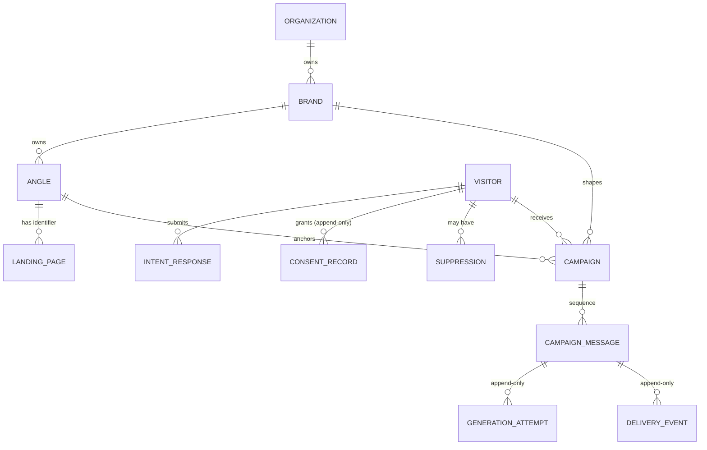

# Architecture - Intent-Led Campaign System

> Status: **Finalised** - this document is the T-01 contract amendment. It defines the
> minimum product domain, the deterministic safety boundary, and the optional evidence
> enrichments that later tickets may choose. T-02 (domain schema), T-09 (generation +
> validation), and T-11 (audit dashboard) must follow this contract. No provisional sections
> remain.

---

## 1. Overview

The system proves one loop end to end at small scale:

```
visitor lands on an angle-specific page
  -> tells us who they are and what they want
  -> system generates and sends a campaign written for that specific person
```

The loop in full:

```
Landing page (static, angle-bound)
  -> capture quiz (intent + preferred form of address + age group + sex + explicit consent)
  -> campaign generation (LLM prose + deterministic facts/blocks)
  -> policy validation (deterministic code)
  -> queued delivery (consent + suppression re-checked at send time)
  -> audit trail (every decision persisted, append-only)
```

### Non-goals

- **No page builder.** Landing pages are hand-written and static; nothing composes pages
  from angle or brand records at runtime.
- **No runtime angle matching.** The angle is fixed by the landing page, never decided by
  quiz answers.
- **No model-authored facts.** The model never invents, approves, or expands health facts.
  It may select from a deterministic evidence source supplied by the application.
- **No mandatory claim entity.** The product does not require a model named `ApprovedClaim`.
  A relational approved-claim registry is an optional enrichment, not a prerequisite for
  the minimum product loop.
- **No SMS provider integration.** Bonus B-01 persists SMS and does not deliver it.

---

## 2. Design principles

1. **Personalisation is the assignment; trust is deterministic.** The LLM is a prose
   draftsman, not an oracle.
2. **Constraints are enforced by code, never merely suggested to the model.**
3. **The model writes only personalisation and transition prose.** It may select identifiers
   from the evidence source supplied by the server, but it cannot create the evidence text.
4. **The angle is chosen by the landing page, not by quiz answers.** The quiz captures
   intent _within_ an angle.
5. **Demographics shape presentation, never clinical claims.** A selected age group and sex
   select a computed presentation profile; the exact age is never stored and neither field can
   become a basis for clinical inference.
6. **All audit records are append-only and immutable.** A review can reconstruct the full
   chain at any time.
7. **The visitor arrives with latent intent, not a made-up mind.** The campaign converts a
   concern or job-to-be-done into a confident next step by resolving the objection - never
   by manufacturing urgency.
8. **Storage shape follows product need.** The PRD requires safe, system-defined evidence,
   not a particular table name. Use relational records when they add meaningful queryability,
   selection, versioning, or audit value; otherwise a deterministic versioned source is valid.

---

## 3. Domain model and ownership boundaries

> T-02 creates the minimum entities and relationships. Optional evidence enrichment may be
> added without changing the core campaign contract.

### Minimum entities

| Entity                             | Owned by                | Purpose                                                                                                 |
| ---------------------------------- | ----------------------- | ------------------------------------------------------------------------------------------------------- |
| `Organization`                     | -                       | Tenant boundary for authenticated administration.                                                       |
| `Brand`                            | Organization            | Visual identity, voice, reading level, sign-off, required/avoided language, and generation constraints. |
| `Angle`                            | Brand                   | Strategic anchor: the 11 PRD fields. Not a headline and not a matcher.                                  |
| `LandingPage` (landing identifier) | Angle                   | Stable mapping from a hand-authored page to an angle.                                                   |
| `Visitor`                          | -                       | Preferred form of address, demographics, and email address for the person being messaged.               |
| `IntentResponse`                   | Visitor                 | One immutable capture of age group, sex, sub-interest, trigger, concern, page, angle, and timestamp.    |
| `ConsentRecord`                    | Visitor                 | Affirmative channel consent with source, timestamp, policy/version, and exact address.                  |
| `Suppression`                      | Visitor                 | Durable opt-out or conversion state that blocks queued and future delivery.                             |
| `Campaign`                         | Visitor + Angle + Brand | One campaign created from a capture and its generation inputs.                                          |
| `CampaignMessage`                  | Campaign                | One row per sequence position and channel.                                                              |
| `GenerationAttempt`                | CampaignMessage         | Append-only prompt/version, provider metadata, raw response, policy result, and composed output.        |
| `DeliveryEvent`                    | CampaignMessage         | Append-only attempted, sent, skipped, or failed delivery event with actionable error.                   |

### Optional enrichment: approved evidence

The PRD requires that health claims be defined in the system rather than improvised by the
model. It does **not** require that the system implement this as an entity called
`ApprovedClaim`.

The mandatory capability is a deterministic **evidence-source boundary**. At generation time,
the application must be able to provide zero or more brand-scoped evidence entries with:

- a stable identifier;
- exact approved text or a deterministic block key;
- category such as fact, mechanism, credential, or disclosure;
- conditions and audience limitations where applicable;
- an active/version state; and
- enough snapshot data to reconstruct what the model was allowed to use.

Possible implementations include:

1. a relational `ApprovedClaim` record with a Brand relationship;
2. versioned configuration or Markdown evidence blocks;
3. deterministic brand/angle proof blocks stored in the owning records; or
4. another equivalent registry that provides the same stable, brand-scoped contract.

A relational `ApprovedClaim` registry is a useful enrichment when reviewers need to maintain,
query, select, archive, and audit many facts. It is not required to create a Brand, manage an
Angle, or satisfy the PRD by name. If an implementation chooses it, it must remain optional
in the core architecture: no unrelated flow may assume its table exists, and its policies,
admin screens, and migrations are additive.

For regulated generation, the absence of an evidence source is not permission to improvise.
If a message needs a health fact and no valid deterministic evidence entry exists, generation
must omit that fact or fail closed.

### Ownership rules

- An `Organization` owns its `Brand` records. Every administrative query is organization-scoped.
- A `Brand` owns its `Angle` records and is the transitive owner of campaigns shaped by them.
- A `LandingPage` maps to exactly one `Angle` by a stable identifier.
- A `Visitor` owns `IntentResponse`, `ConsentRecord`, and `Suppression`; these are never
  silently overwritten. Consent and suppression changes are appended as new records or events.
- A `CampaignMessage` is keyed by `(campaign_id, sequence_position, channel)` so email
  audit data is queryable without parsing blobs.
- If an optional evidence registry is used, every evidence entry and every angle proof
  reference must resolve to the same owning Brand. Cross-brand evidence is invalid.
- Archiving a Brand or Angle must not cascade-delete campaign evidence or audit records.



Optional evidence entries are deliberately omitted from the minimum diagram. If a project
selects the relational enrichment, it may add `APPROVED_EVIDENCE` owned by `BRAND` and an
angle-to-evidence selection relation without changing the minimum visitor-to-campaign loop.

---

## 4. Landing page -> angle -> brand

A landing page resolves its brand and angle through the chain `page -> brand -> angle`.
The public URL includes the numeric Brand id because Brand slugs are unique only within an
organization: `/angles/{brandId}/{landingIdentifier}`.

### Binding: authored page, deterministic presentation

- The page **copy and quiz questions are authored in code** for one stable landing identifier;
  they are not composed from Angle or Brand records and there is no page builder.
- The page may read a sanitized runtime presentation DTO containing the selected Brand's name,
  logo URL, colors, and approved font stacks. It must not receive the Brand prompt profile,
  preferred/avoided terms, provider settings, or unrestricted Angle strategy data.
- Each Angle may be assigned one allowlisted `landing_identifier` by an administrator. An active
  Brand can assign each hand-authored page to at most one Angle, while an Angle may remain
  unassigned until a page is selected.
- At capture, the landing identifier resolves to the current active Brand-owned Angle. The
  active Angle is the authoritative generation input for later campaigns.

```
Landing page (hand-authored copy and quiz)
  |-- landing_identifier: "fatigue"            <- fixed, allowlisted
  |-- brand_id: 1                               <- explicit public route context

Angle record (dynamic, admin-managed)
  |-- brand_id: 1
  |-- slug: "fatigue"                           <- stable strategy identifier
  |-- landing_identifier: "fatigue"             <- selected in backoffice
```

### Consequences

- **Admin edits to an Angle** change future campaign generation and may change which static page
  receives new visitors, not the hand-authored page copy or quiz. Possible drift is accepted in
  this demo.
- **Admin edits to a Brand** change live email generation and future page presentation, but do
  not dynamically rewrite page copy or quiz questions.
- **Brand visual tokens are runtime-selected** from the active Brand record. Brand voice and
  generation constraints remain server-side campaign inputs, never public page data.
- Brand constraints are machine-enforced on generated copy. Hand-written landing pages are
  reviewed as authored application code.

### Edge cases

- **Archived Brand or Angle** -> the page or quiz identifier stops resolving -> the route returns
  a clear unavailable state and capture rejects with "campaign unavailable". Historical audit
  records remain.
- **Angle without a page** -> an admin-created angle has no entry point until a developer
  hand-writes a page for it. This is deliberate scope, not a page-builder gap.
- **Eligibility rule** -> an angle may generate campaigns only if an active landing
  identifier maps to it.

---

## 5. Brand-field routing

Brand fields are split by who controls them and how they reach generation. The exact storage
shape is not prescribed beyond the deterministic safety boundary.

| Brand field                      | Routing                             | Generation role                                                       |
| -------------------------------- | ----------------------------------- | --------------------------------------------------------------------- |
| Visual identity                  | Deterministic                       | Rendered by the email/UI layer; never invented by the model.          |
| Tone, flow, tense, reading level | Hard instruction                    | Loaded from the versioned brand writing profile.                      |
| Preferred terms                  | Bounded guidance                    | May influence wording where natural and safe.                         |
| Avoided terms                    | Hard validation rule                | Rejected if present in generated copy.                                |
| Required language                | Deterministic block/validation rule | Appended or verified by code.                                         |
| Sign-off style                   | Deterministic block                 | Appended by code; the model does not invent it.                       |
| Compliance language              | Deterministic block/validation rule | Appended or verified by code.                                         |
| Evidence/proof entries           | Deterministic source                | Supplied as exact entries or block keys; never invented by the model. |

The four writing preferences use named values with a balanced midpoint. Long-form guidance
lives in server-only Markdown under `resources/llm/config/brands/`; configuration stores
labels and file mappings, and the prompt version identifies the resulting recipe.

### Tone and tense sign-off matrix

Sign-off style is derived from the Brand's `tone` and `tense` values rather than stored as a
separate editable preset. `Tone` controls social distance and formality. `Tense` is the UI
label for emotional temperature: it controls how restrained, reassuring, or easygoing the
closing feels. `Flow` and `reading_level` shape the message body, but do not participate in
sign-off selection.

The matrix is a generation instruction and resolution rule, not permission for the model to
invent a signature. The Brand supplies the signature identity (for example, `The Lexical Labs
team` or `XO Health Clinical Team`); deterministic code chooses the valediction family and
appends the final sign-off after model validation.

| Tone / Tense | Serious                                                                                       | Balanced                                                                                   | Relaxed                                                                                                     |
| ------------ | --------------------------------------------------------------------------------------------- | ------------------------------------------------------------------------------------------ | ----------------------------------------------------------------------------------------------------------- |
| **Formal**   | Formal and restrained: use a conventional valediction and the full team or clinical identity. | Professional and warm: retain the formal identity while allowing a courteous, human close. | Conventional but lighter: keep the formal identity and remove unnecessary rigidity without becoming casual. |
| **Balanced** | Direct and composed: use a concise team signature with no flourish.                           | Warm and trustworthy: use a calm, human team identity and a measured close.                | Approachable and easygoing: use a helpful team identity and a light close without banter.                   |
| **Informal** | Plain and grounded: use a conversational identity and a concise, steady close.                | Conversational and supportive: use a peer-like team identity and a friendly close.         | Friendly and relaxed: use a natural close without hype, jokes, or false intimacy.                           |

For the same signature identity, the resolver may produce different deterministic closings:

```text
Tone: informal | Tense: relaxed
Take care,
The Lexical Labs team

Tone: formal | Tense: serious
Sincerely,
XO Health Clinical Team
```

The model may receive the selected matrix cell as structured writing guidance so it understands
the intended relationship between Brand properties. It must not emit, alter, or override the
signature identity, valediction, compliance language, unsubscribe footer, or other deterministic
blocks. A prompt preview should expose the selected `tone`, `tense`, and derived sign-off profile
so a reviewer can see why the closing was chosen.

### Evidence and proof policy

`Proof` in an Angle is a reference to deterministic evidence, not a free-text invitation for
the model to make a claim. An implementation may represent that reference with relational
`ApprovedClaim` IDs, evidence block keys, or another stable identifier set. The runtime
contract remains the same:

1. the server supplies the allowed evidence for the owning Brand;
2. the model may select identifiers only;
3. the validator resolves each identifier against the current brand-scoped source;
4. final composition uses validated evidence text or deterministic blocks; and
5. the generation attempt snapshots the supplied evidence so later edits do not rewrite history.

No evidence source means no invented evidence. A message that cannot be composed safely fails
closed rather than falling back to model-authored health facts.

---

## 6. Angle-field routing

The 11 PRD Angle fields split into four buckets by who writes them and how freely. None are
hidden from generation merely to avoid validation; safety comes from deterministic checks.

| Bucket               | Fields                                                          | Model's role                                                                              |
| -------------------- | --------------------------------------------------------------- | ----------------------------------------------------------------------------------------- |
| **Deterministic**    | Proof, Offer, Next step                                         | Uses evidence identifiers/block keys and transitions into fixed offer/CTA blocks.         |
| **Hard instruction** | Tone                                                            | Applies the configured angle tone without changing it.                                    |
| **Bounded prose**    | Single promise, Objection                                       | Restates the promise without expanding it; addresses the objection without inventing one. |
| **Context**          | Audience, Trigger moment, Primary job, Tension, Desired outcome | Shapes emphasis and framing without becoming a diagnosis, guarantee, or urgency claim.    |

Per-field detail:

| Angle field     | Bucket           | Reaches model as           | Rationale                                                       |
| --------------- | ---------------- | -------------------------- | --------------------------------------------------------------- |
| Audience        | Context          | text                       | Write for the right person.                                     |
| Trigger moment  | Context          | text                       | Acknowledge the real trigger; never escalate it.                |
| Primary job     | Context          | text                       | Drive emphasis toward the progress the visitor described.       |
| Tension         | Context          | text                       | Provide empathetic framing; validation caps clinical inference. |
| Desired outcome | Context          | text                       | Frame the desired change; never promise it as guaranteed.       |
| Single promise  | Bounded prose    | text                       | Content is authoritative; phrasing may be personalised.         |
| Proof           | Deterministic    | evidence IDs or block keys | Facts come from the current evidence source.                    |
| Objection       | Bounded prose    | text                       | Address the recorded objection; never invent one.               |
| Offer           | Deterministic    | none                       | Truthful terms are never paraphrased by the model.              |
| Tone            | Hard instruction | enum                       | Applies the angle-level style constraint.                       |
| Next step       | Deterministic    | none                       | Keeps the CTA consistent and truthful.                          |

The context bucket is most likely to drift toward diagnosis or urgency. The deterministic
validator is the backstop that makes these fields safe: they remain generation context, but
cannot authorize a new health fact, diagnosis, cure, outcome, scarcity claim, or comparison.

---

## 7. Generation: LLM vs deterministic split

| Deterministic (code)                                               | LLM (model)                                                |
| ------------------------------------------------------------------ | ---------------------------------------------------------- |
| Brand constraints: voice, reading level, required/avoided language | Restating the promise in the visitor's language            |
| Deterministic evidence source, if needed                           | Explaining the mechanism using supplied evidence           |
| Compliance blocks, offer, sign-off, unsubscribe footer             | Addressing the angle-specific objection                    |
| Sequence shape: promise -> mechanism -> objection                  | Subject line, headline, and bounded body prose             |
| Consent and suppression checks                                     | Selecting evidence identifiers from the supplied allowlist |
| Demographic -> presentation profile lookup                         | -                                                          |
| Policy validator, retry, fail-closed                               | -                                                          |
| Final email composition                                            | -                                                          |
| Audit persistence                                                  | -                                                          |

The evidence source is a **mandatory safety capability only when a message needs factual or
clinical content**. Its persistence form is an implementation choice. The model receives
structured entries such as:

```json
{
  "evidence": [
    {
      "id": "evidence-001",
      "category": "mechanism",
      "text": "Exact system-approved text.",
      "conditions": "Any limits or audience conditions.",
      "version": "v1"
    }
  ]
}
```

The final email is composed as:

```
validated model core (subject + headline + bounded body prose)
+ validated deterministic evidence blocks, when applicable
+ deterministic offer block
+ deterministic compliance language
+ deterministic sign-off
+ unsubscribe footer
```

### Presentation profile (demographics)

Age group and sex map through a fixed lookup table in code to a presentation profile. The system
stores the selected age group, not the visitor's exact age:

- vocabulary register, sentence length/pacing, and reassurance versus brevity;
- typography, type size, visual density, and imagery tone.

The profile is computed in code, passed to the model as **presentation instructions**, and
used by the email renderer. Raw demographics are not passed as a basis for clinical reasoning.

### Offer, next step, and the terminal CTA

The business is DTC blood testing. The visitor lands with a concern or job-to-be-done, not a
purchase decision. The campaign converts that latent intent into a confident next step by
making the mechanism plain and resolving the recorded objection. It reinforces motivation;
it never manufactures urgency.

- **`offer`** = what makes acting now easier, such as a truthful discount or bundle. Terms
  must be precise and are never invented or paraphrased by the model.
- **`next step`** = the smallest clear CTA, such as "Order the fatigue panel", framed as
  getting clarity on numbers rather than diagnosing a condition.
- Both are deterministic, angle-scoped blocks composed after the objection is handled,
  normally in email 3 or a later beat.

---

## 8. Model response schema

The model returns valid JSON for the three beats. The response schema is deliberately
storage-neutral: `evidence_ids` may resolve to a relational enrichment or another
brand-scoped deterministic source.

```jsonc
{
  "messages": [
    {
      "position": 1, // 1..3, fixed
      "role": "promise", // promise | mechanism | objection
      "subject": "string", // validated for accuracy
      "headline": "string",
      "body_paragraphs": ["..."], // bounded personalisation/transition prose
      "evidence_ids": ["evidence-001", "..."], // optional; IDs only, never evidence text
    },
  ],
}
```

- Positions 1, 2, and 3 are fixed as promise, mechanism, and objection.
- `evidence_ids` must resolve to entries supplied for the campaign's Brand when the message
  uses factual evidence. It may be empty for a message containing no evidence block.
- The model cannot emit offer, compliance, sign-off, unsubscribe, or deterministic CTA text
  as authoritative content.
- The formal schema will live in `resources/llm/response-schema.md` in T-09. This document
  fixes the storage-neutral shape and ownership invariant.
- Each attempt records prompt version, provider/model, raw structured response, evidence
  snapshot, policy result, and final composed output.

If a later implementation uses `ApprovedClaim`, its record IDs are simply one valid mapping
for `evidence_ids`; the response contract does not require that entity.

---

## 9. Validation, retry, and fail-closed policy

The validator is **deterministic code, not a second LLM**. This is what makes the guardrails
enforced rather than suggested.

### Validator checks

1. **Structural validity** - JSON parses; all three positions are present with required fields.
2. **Evidence reference validity** - every `evidence_id` resolves to an active entry in the
   campaign's brand-scoped source; no model-authored evidence text is accepted as a fact.
3. **Banned phrases absent** - brand avoided terms plus the global prohibited category list.
4. **Required language present** - required compliance language is appended or verified by
   code.
5. **No diagnosis/cure/outcome language** - global guardrail.
6. **No demographic clinical inference** - demographics may affect presentation only.
7. **No false urgency, scarcity, hidden conditions, or misleading comparisons.**
8. **Subject accuracy** - the subject does not assert anything stronger than the body.
9. **Evidence availability** - if factual content is required and no deterministic evidence
   exists, reject or fail closed; never ask the model to fill the gap.

### Pipeline (worst case: two LLM calls)

```
LLM call 1 -> generate
  -> validator (code)
      ├─ pass      -> compose & persist -> queue send
      └─ fail      -> LLM call 2: reprompt with the violation list
                       -> validator (code)
                           ├─ pass      -> compose & persist -> queue send
                           └─ fail      -> persist failed GenerationAttempt, send nothing
```

- **Fail-closed:** any persistent failure (invalid twice, provider error, malformed output,
  timeout, rate limit, missing evidence, or validator exception) records a failed attempt and
  sends nothing.
- A second LLM is deliberately not used as the auditor. It would add another component that
  can fail or be gamed, at extra cost.

---

## 10. Safety policy: guardrails -> enforcement

| PRD guardrail                                                            | Enforcement mechanism                                                                                                                                                                                          |
| ------------------------------------------------------------------------ | -------------------------------------------------------------------------------------------------------------------------------------------------------------------------------------------------------------- |
| No unapproved health claims                                              | The application supplies a deterministic evidence source. The model selects IDs only; the validator rejects unknown IDs and model-authored evidence. The source may be relational, configured, or block-based. |
| No clinical inference from demographics                                  | Presentation profile is computed in code; demographics are not passed as a clinical basis; validator rejects inference patterns.                                                                               |
| No false urgency, scarcity, hidden conditions, or misleading comparisons | Offer and next step are deterministic; validator scans model prose.                                                                                                                                            |
| Consent and suppression enforced                                         | Affirmative `ConsentRecord` is required before generation; consent and suppression are re-checked immediately before each send.                                                                                |
| Subject lines accurately represent the message                           | Subject is validated against the bounded body and deterministic blocks before send.                                                                                                                            |

This policy intentionally guarantees a capability, not a table name. `ApprovedClaim` can make
the evidence source easier to administer and audit, but omitting it does not waive the safety
rule.

---

## 11. Worked examples

### 11.1 Personalisation: different presentation, same evidence

Angle: **fatigue / low energy**, brand voice **clinical and reassuring**.

The evidence source supplies the same entries to both visitors:

- E1 - "A complete blood count measures red blood cell, hemoglobin, and hematocrit levels."
- E2 - "An iron panel measures ferritin, serum iron, and transferrin saturation."
- E3 - "Vitamin B12 and folate are measured because low levels are a recognised cause of
  tiredness."

|                      | Visitor A                                                              | Visitor B                                                              |
| -------------------- | ---------------------------------------------------------------------- | ---------------------------------------------------------------------- |
| Age group / sex      | 18-29, female                                                          | 45-59, male                                                            |
| Sub-interest         | "always drained after workouts"                                        | "energy crashes mid-afternoon"                                         |
| Concern              | "low iron"                                                             | "thyroid in the family"                                                |
| Presentation profile | Short sentences, low reassurance, compact layout, lighter type density | Longer sentences, higher reassurance, more breathing room, larger type |
| Voice result         | Direct, pragmatic, minimal hedging                                     | Patient, explanatory, more reassurance                                 |
| **Evidence set**     | **E1, E2, E3**                                                         | **E1, E2, E3**                                                         |

The emails differ materially in register, pacing, emphasis, and layout while using the exact
same evidence set. Neither email states or implies a diagnosis, cure, expected result, or
"what they probably have". Demographics change only how the same evidence is presented.

### 11.2 Brand divergence: same situation, different brands

Identical situation: the same angle and visitor, but two brands:

|                 | Lexical Labs                             | XO Health Group                            |
| --------------- | ---------------------------------------- | ------------------------------------------ |
| Identity        | Millennial, modern, approachable         | Conservative, long-trusted, hospital-grade |
| Voice           | Warm, conversational                     | Formal, authoritative, reassuring          |
| Visual identity | Modern palette, friendly type            | Restrained palette, traditional type       |
| Result          | Short, upbeat sentences, casual sign-off | Longer form, formal sign-off               |

The two emails are recognisably different in look and voice because of brand settings, not
because the model was allowed to invent different facts. If the brands use a relational or
configured evidence source, each email can reference only evidence owned by its own Brand.

---

## 12. Delivery and audit invariants

These invariants bind the later generation and delivery tickets:

- A campaign cannot be generated without active email consent.
- A message cannot be sent without a fresh consent/suppression check.
- Model output is inert until it passes deterministic validation.
- Generated facts must resolve to the deterministic evidence source or be rejected.
- Offer, compliance language, sign-off, unsubscribe footer, and CTA are code-composed.
- Every generation attempt snapshots the prompt version, model metadata, evidence allowed,
  policy result, and final composition.
- Every delivery attempt appends a delivery event; a skipped or failed send is never presented
  as sent.
- Archive operations preserve historical references and audit records.

---

## 13. Related contracts

- **Codebase contract:** this file plus `SECURITY.md`.
- **Runtime LLM contracts** in `resources/llm/`: `safety-policy.md`, `response-schema.md`,
  `writing-rules.md`, and brand voice files under `config/brands/<property>-<level>.md`.
  These static Markdown files are assembled with per-call structured data (brand settings,
  deterministic evidence when available, angle, visitor presentation profile, and consent
  context). `config/brands.php` maps preset metadata to the voice files but does not contain
  their long-form instructions.
- `resources/` is not Laravel's public web root, so runtime contracts remain server-side.
- **README:** setup, seeded demo, end-to-end journey, and safety/design decisions.

## 14. Web routing and page structure

Every browser-facing page begins with a Laravel web route and a Blade shell. Laravel owns the
initial URL contract, server-side middleware, CSRF or authentication metadata, and the initial
HTML response. A route family may return the same Blade shell for several related URLs, but a
client-side URL must never exist without a Laravel route that can serve its shell on direct
navigation and browser refresh.

### Shells and client workflows

- A Blade shell is a small HTML envelope that loads the page's Vite entrypoint and mounts its
  Vue application. It does not replace Laravel middleware or silently become an API endpoint.
- Each shell has a clear Vue entrypoint and root component. Separate shells remain separate Vue
  applications; they do not share client state implicitly.
- Simple or static landing and public-facing pages default to Laravel route + Blade. They may
  use Vue for local interactive islands, but do not gain a client router without a real
  multi-view workflow. Static landing copy and quiz questions remain hand-authored and
  message-matched as defined in section 4. Runtime Brand selection is limited to the
  sanitized presentation DTO described there.
- Extensive backoffice or public-facing workflows with multiple views, dynamic records, or
  complex navigation may use Vue Router 4 inside their owning Blade shell. The router is scoped
  to that shell and controls only the client-side portion of the route family.
- Laravel remains the access-control boundary. `guest`, `auth`, and other route middleware are
  registered in `routes/web.php` and run before the Blade shell is served. Client-side guards
  may improve UX but never replace server enforcement.

### Deep links and API separation

Every Vue Router deep link must have a corresponding Laravel shell route that preserves the
same middleware and returns the same Blade entrypoint. On refresh, the Vue application rebuilds
its view from the URL and authorized API data; it must not rely on in-memory selection state.
Laravel shell routes do not need to resolve client-side records unless the page explicitly
requires server-rendered data.

API endpoints remain under `routes/api.php`, use their own middleware, and return structured JSON
only. They do not serve Blade views and are not substitutes for browser page routes.

### New page checklist

When adding a browser-facing page or route family:

1. Add a Laravel web route with the correct `guest` or `auth` middleware.
2. Add or reuse the appropriate Blade shell and its Vite entrypoint.
3. Keep simple/static content in the shell; introduce a shell-scoped Vue Router only when the
   workflow is genuinely extensive.
4. Capture every supported client deep link at Laravel so direct navigation and refresh work.
5. Reconstruct client state from URL parameters and authorized API data.
6. Keep JSON endpoints in `routes/api.php` and review organization/security boundaries. Public
   landing and capture routes must re-resolve the Brand and allowlisted landing identifier on
   the server; browser-provided Angle ids or private Brand settings are never authoritative.
